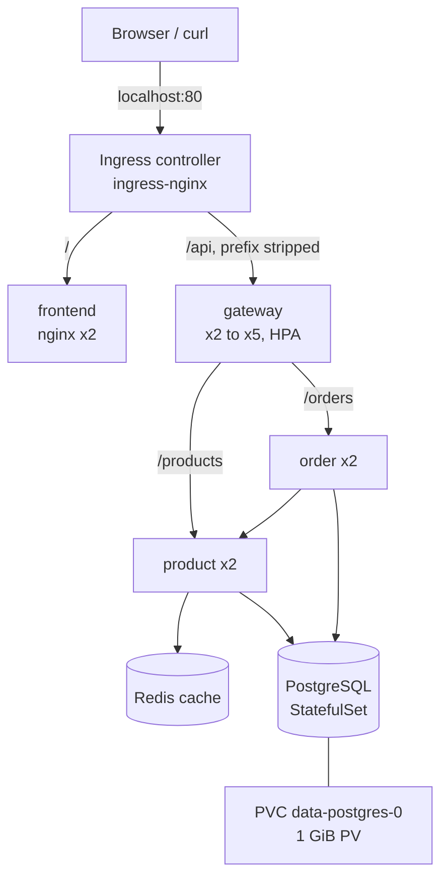

# Resilient E-commerce on Kubernetes

A production-style deployment of a microservices e-commerce app on a local **kind** cluster, demonstrating zero-downtime rolling updates, self-healing, CPU-based auto-scaling, persistent storage, and layered security.

The app reuses the hardened Node.js images from my [microservices-ecommerce](https://github.com/Thormie-Harshey/microservices-ecommerce) project (`thormie/ecommerce-*:v1.0.1`).

## Architecture



| Tier | Resource | Replicas | Service |
|---|---|---|---|
| Frontend | Deployment (nginx-unprivileged, page from ConfigMap) | 2 | ClusterIP `frontend` :80 → 8080 |
| Backend API | Deployments: gateway, product, order | 2 each (gateway 2 to 5) | ClusterIP `gateway` :3000, `product` :3001, `order` :3002 |
| Cache | Deployment (Redis, no persistence, 100 MB LRU cap) | 1 | ClusterIP `redis` :6379 |
| Database | StatefulSet (PostgreSQL 18.6) + PVC | 1 | Headless `postgres` :5432 |

Cluster: kind, 1 control-plane and 2 workers (Kubernetes v1.35.0). Everything runs in the `ecommerce` namespace.

## Manifest layout

Files in `k8s/` are numbered in apply order:

| File | Purpose |
|---|---|
| `00-namespace.yaml` | Namespace isolation |
| `01-configmap.yaml` | All non-secret settings (hosts, ports, cache TTL) |
| `secret.example.yaml` | Template for DB credentials (the real `secret.yaml` is git-ignored) |
| `02` to `05` | PostgreSQL (headless Service, StatefulSet) and Redis |
| `06` to `11` | product, order, gateway (Services and Deployments) |
| `12-gateway-hpa.yaml` | HPA: CPU 50%, 2 to 5 pods |
| `13-backend-pdbs.yaml`, `17-frontend-pdb.yaml` | PodDisruptionBudgets, `minAvailable: 1` |
| `14` to `16` | Frontend page ConfigMap, Service, Deployment |
| `18-ingress.yaml` | Path routing: `/` to frontend, `/api` to gateway (with rewrite) |
| `19-network-policies.yaml` | Default deny plus per-tier allow rules |

## Resilience features

- **Rolling updates:** `maxSurge: 1`, `maxUnavailable: 0` on every Deployment, so capacity never drops below normal.
- **Probes on every container:** readiness gates traffic; liveness restarts stuck containers. product and order use a deep readiness check (`/health` tests PostgreSQL and Redis) but a shallow liveness check (`tcpSocket`), so a dependency outage removes pods from traffic instead of restarting them in a cascade.
- **Graceful shutdown:** a 5-second `preStop` sleep lets the Service stop routing to a pod before it exits.
- **Requests and limits on every container.**
- **PodDisruptionBudgets** keep at least 1 pod of each app tier during node drains.
- **HPA** on the gateway, driven by metrics-server.

## Security

- **Non-root everywhere:** PostgreSQL uid 70, Redis uid 999, Node services uid 1001, nginx uid 101; `allowPrivilegeEscalation: false` and all Linux capabilities dropped.
- **Secrets:** credentials live in the Secret `db-credentials`, injected with `secretKeyRef`. The real file is git-ignored; only a placeholder template is committed. Note that Secrets are only base64-encoded; production would add encryption at rest, RBAC restrictions, or an external secret manager (Vault, Sealed Secrets).
- **Network Policies:** default deny on all ingress, then only these paths are allowed:

| From | To | Port |
|---|---|---|
| ingress-nginx | frontend, gateway | 8080, 3000 |
| gateway | product, order | 3001, 3002 |
| order | product | 3001 |
| product, order | postgres | 5432 |
| product | redis | 6379 |

- **Configuration:** all settings in ConfigMaps; no hardcoded values in images.

## Deployment instructions

Prerequisites: Docker Desktop, kind, kubectl (commands run in Ubuntu on WSL).

```bash
# 1. Cluster
kind create cluster --config kind-config.yaml

# 2. Load images into the nodes (export amd64 only; see Troubleshooting)
for img in postgres:18.6-alpine3.24 redis:8.10.2-alpine3.23 nginxinc/nginx-unprivileged:1.31.6-alpine3.24 \
           thormie/ecommerce-product:v1.0.1 thormie/ecommerce-order:v1.0.1 thormie/ecommerce-gateway:v1.0.1; do
  docker save --platform linux/amd64 "$img" -o /tmp/img.tar
  kind load image-archive /tmp/img.tar --name resilient-app
done
rm /tmp/img.tar

# 3. metrics-server (insecure TLS is for local kind only, never production)
kubectl apply -f https://github.com/kubernetes-sigs/metrics-server/releases/latest/download/components.yaml
kubectl patch deployment metrics-server -n kube-system --type=json \
  -p='[{"op":"add","path":"/spec/template/spec/containers/0/args/-","value":"--kubelet-insecure-tls"}]'

# 4. Ingress controller, pinned to the labelled control-plane with host ports
kubectl apply -f https://raw.githubusercontent.com/kubernetes/ingress-nginx/main/deploy/static/provider/kind/deploy.yaml
kubectl patch deployment ingress-nginx-controller -n ingress-nginx --type=strategic -p '{"spec":{"template":{"spec":{"nodeSelector":{"ingress-ready":"true"},"tolerations":[{"key":"node-role.kubernetes.io/control-plane","operator":"Exists","effect":"NoSchedule"}],"containers":[{"name":"controller","ports":[{"containerPort":80,"hostPort":80,"name":"http","protocol":"TCP"},{"containerPort":443,"hostPort":443,"name":"https","protocol":"TCP"}]}]}}}}'

# 5. Secret (set a real password first)
cp k8s/secret.example.yaml k8s/secret.yaml   # then edit POSTGRES_PASSWORD
kubectl apply -f k8s/00-namespace.yaml -f k8s/secret.yaml

# 6. Everything else, in order
kubectl apply -f k8s/0*.yaml -f k8s/1*.yaml

# 7. Open the shop
curl http://localhost/api/products   # or open http://localhost in a browser
```

## Resilience test results

All logs are in `tests/`. Tests ran on October 7, 2026.

| # | Test | Method | Result |
|---|---|---|---|
| 1 | Zero-downtime deploy | ~20 req/s against `/api/products` during `kubectl set image` on the gateway | **252/252 requests returned 200**, zero 5xx |
| 2 | Self-healing | Deleted a product pod under load | Replacement Running in ~20 s; **273/273 requests returned 200** |
| 3 | Auto-scaling | 10 parallel request loops | CPU rose to **209%** of target; HPA scaled gateway **2 to 4** pods |
| 4 | Data persistence | Deleted `postgres-0` | New pod (UID changed), same PVC; order and product **intact**, verified via API and `psql` |

Notes:
- Test 1 used `v1.0.2`, a re-tag of `v1.0.1`, to trigger a genuine rolling update without a new build. The manifests stay on `v1.0.1`.
- Test 4: for a few seconds after PostgreSQL restarted, order returned an error because its readiness check correctly removed it from traffic while the database was down. It rejoined automatically.

## Evidence

| # | Screenshot |
|---|---|
| 01 | [Cluster nodes](screenshots/01-cluster-nodes.png) |
| 02 | [ConfigMap and Secret](screenshots/02-config-and-secret.png) |
| 03 | [StatefulSet, PVC and PV](screenshots/03-postgres-statefulset-pvc.png) |
| 04 | [PostgreSQL non-root and working](screenshots/04-postgres-nonroot-working.png) |
| 05 | [Redis non-root and working](screenshots/05-redis-nonroot-working.png) |
| 06 | [Product pods across nodes](screenshots/06-product-running.png) |
| 07 | [Cache hit](screenshots/07-product-cache-hit.png) |
| 08 | [Order placed end to end](screenshots/08-order-placed.png) |
| 09 | [Gateway routing, all pods](screenshots/09-gateway-routing-all-pods.png) |
| 10 | [Order startup race condition](screenshots/10-order-race-condition-log.png) |
| 11 | [HPA baseline](screenshots/11-hpa-idle-baseline.png) |
| 12 | [PodDisruptionBudgets](screenshots/12-pdbs.png) |
| 13 | [Frontend served, non-root](screenshots/13-frontend-served.png) |
| 14 | [Shop in the browser via Ingress](screenshots/14-browser-shop-via-ingress.png) |
| 15 | [Ingress curl checks](screenshots/15-ingress-curl.png) |
| 17 | [Network Policies test](screenshots/17-network-policies-test.png) |
| 18 | [Test 1: zero downtime](screenshots/18-test1-zero-downtime.png) |
| 19 | [Test 2: self-healing](screenshots/19-test2-self-healing.png) |
| 20 | [Test 3: auto-scaling](screenshots/20-test3-autoscaling.png) |
| 21 | [Test 4: data persistence](screenshots/21-test4-data-persistence.png) |

## Troubleshooting log

- **`kind load docker-image` failed with "content digest not found".** Docker Desktop stores multi-platform images but only the amd64 layers were downloaded. Fix: `docker save --platform linux/amd64` then `kind load image-archive`.
- **Ingress returned empty responses.** The current ingress-nginx kind manifest no longer pins the controller to the labelled node, so it ran on a worker without host ports. Fix: the patch in step 4 above.

## Known limitations

- **PostgreSQL runs a single replica.** Replication is out of scope; the StatefulSet and PVC provide persistence, not database high availability.
- **Order startup race condition.** Two order pods starting together both try to create the `orders` table; one fails once and is restarted by Kubernetes (screenshot 10). Planned fix: an init container or Job that runs the migration once.
- **product readiness depends on Redis**, so a cache outage takes product out of traffic. A code change would let it fall back to PostgreSQL.
- **ingress-nginx was retired by Kubernetes in March 2026** and no longer receives security fixes. Acceptable for a local lab; production would use Gateway API or a maintained controller such as Traefik.
- **kind storage** is a folder on the node and does not strictly enforce the 1 GiB size.

## Bonus items not yet implemented

TLS with cert-manager, pod anti-affinity, init container migration, and a Helm chart with dev/staging/prod values.
